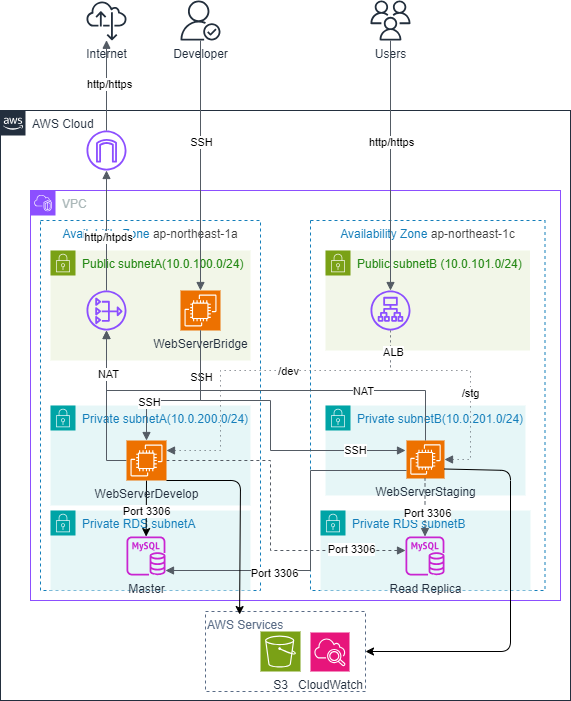
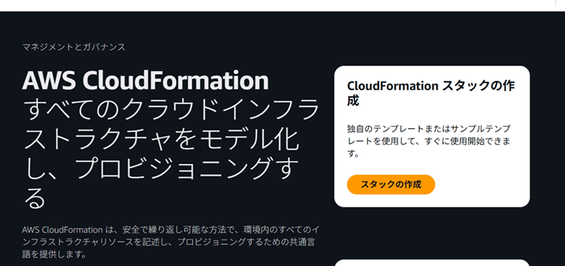
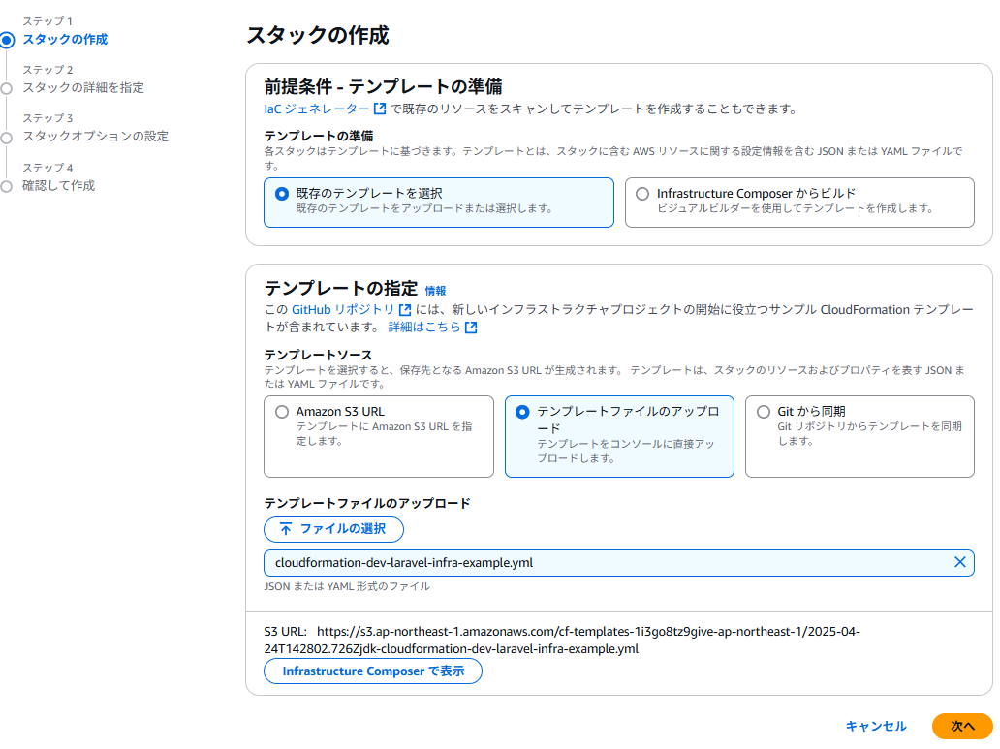
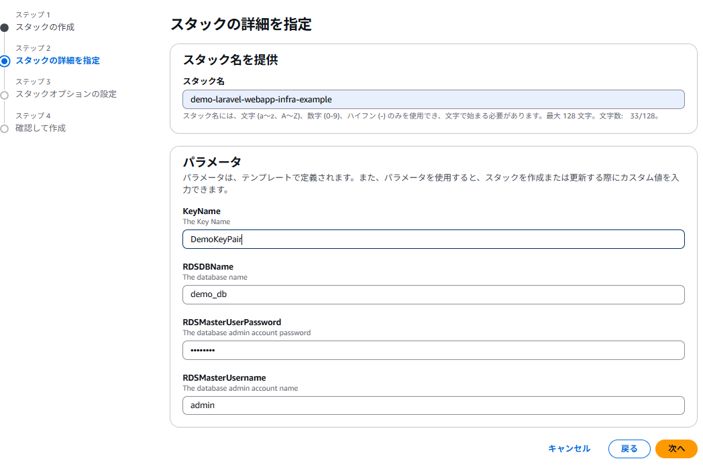
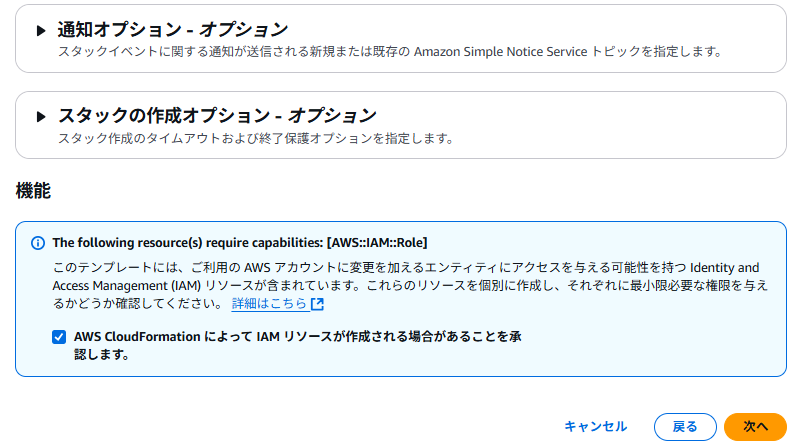
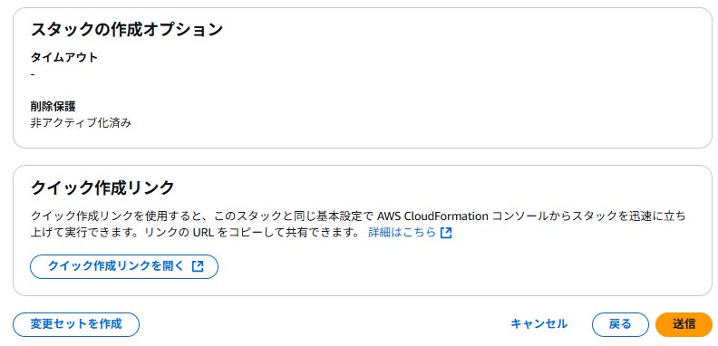
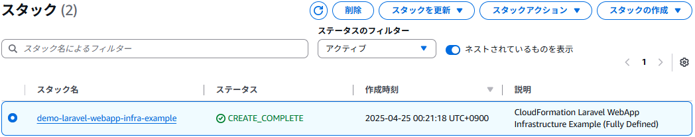
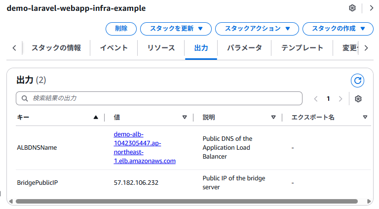

# CloudFormation Laravel WebApp Infrastructure Example

このリポジトリは、AWS CloudFormation によって構築されるWeb開発用インフラテンプレートです。
セキュリティを重視し、SSH秘密鍵はCloudFormationで一切保持せず、**各自の公開鍵を渡して構築**します。

---

## 📐 構成概要


- Lamp環境構築(Linux、Apache、Mysql、PHP+Laravel)
- RDSはMySQLを使用し、マスター、リードレプリカを構成
- VPC（2AZ構成）
- PublicサブネットA: Bridgeサーバ（踏み台）
- PublicサブネットB: NAT Gateway配置用
- PrivateサブネットA/B: Webサーバ（Develop・Staging）、RDS（マスター・リードレプリカ）配置
- ALB（Application Load Balancer）を構築し、/dev/*, /stg/* でパス振り分け
- NAT Gateway、Internet Gateway、Route Table、セキュリティグループ
- SSH接続用のキーペアはパラメータ（KeyName）からCloud Formation実行時パラメータとして指定（秘密鍵は自前で管理）
- 一部設定ファイルはS3バケットより取得(S3+IAM連携で高セキュリティ対応)

---

## 🔐 キーペアの生成と接続方法

### はじめに
- あらかじめEC2より利用するキーペアの生成をお願いします。(pem推奨)
- CloudFormation実行後ローカルマシンにてWebServerBridgeのパブリックIPの設定をお願いします。
- Macの場合はターミナル、Windowsの場合はGitBashなどをご利用下さい。


## 🚀 Cloud Formation 実行方法

**AWSコンソール画面よりCloud Formation → スタックの作成**

```bash
『スタックの作成』ボタンを押下
```

---

**Step１　スタックの作成**


|テンプレートの準備|『既存のテンプレート』を選択|
|テンプレートの指定|『テンプレートファイルのアップロード』を選択|
|ファイルの選択|本リポジトリより『cloudformation-dev-laravel-infra-example.yml』を選択|

```bash
エラーがなければ『次へ』ボタンを押下して下さい。
```

---

**Step２　スタックの詳細を指定**



|スタック名|適当に|
|KeyName|利用するキーペア名。事前に作成しておいて下さい。|
|RDSDBName|スキーマ名。デフォルトは『demo_db』|
|RDSMasterUserPassword|DBパスワード。デフォルトは『testpass』|
|RDSMasterUsername|DBユーザ名。デフォルトは『admin』|

```bash
詳細を入力し、『次へ』ボタンを押下して下さい。

※ パラメータを変更した場合、利用時にLamp環境の設定を変える必要があります。
```

---

**Step３　スタックオプションの設定**


```bash
本テンプレートはCloud Formation実行時にS3を利用するため 
『AWS CloudFormation によって IAM リソースが作成される場合があることを承認します。』
にチェックを入れ『次へ』ボタンを押下して下さい。
```

---

**Step４　確認して作成**

```bash
特に変更点はないため『送信』ボタンを押下しスタックを作成して下さい。
作成には15～30分程度掛かります。
```

**Step5　チェックすること**


```bash
対象スタックのステータスが『CREATE_COMPLETE』になれば完了です。
```



作成完了後、対象スタックの『出力』タグに以下の情報が表示されます。

|ALBDNSName|ブラウザからWebサーバにアクセスするためのエンドポイント|
|BridgePublicIP|WebServerBridgeサーバのパブリックIP|

---

## 💻 ローカルマシンからの接続方法について

ローカルマシンの種類(Mac、Windows)により色々な接続方法がありますが、ここでは以下を想定してご説明致します。
キーペアはpemを利用することをお勧めします。
なお、WebServerBridgeの接続IPは『BridgePublicIP』となります。

- Windows → Git Bash
- Mac → ターミナル


### Step1 ~/.ssh/configファイルの修正 (なければ新規作成)
.ssh/configファイルを編集し、以下の項目を変更して下さい。

|bridgeServer|HostName|対象スタックの『出力』に表示されていた『BridgePublicIP』|
|bridgeServer|IdentityFile|ローカルに保存したキーペアファイルのフルパス|
|develop|IdentityFile|ローカルに保存したキーペアファイルのフルパス|
|staging|IdentityFile|ローカルに保存したキーペアファイルのフルパス|


```bash
HOST bridge
  HostName <WebServerBridgeのパブリックIP>
  User ec2-user
  IdentityFile <ローカルに保存したキーペアファイルのフルパス>
  ForwardAgent yes

Host develop
  HostName 10.0.200.10
  User ec2-user
  IdentityFile <ローカルに保存したキーペアファイルのフルパス>
  ProxyJump bridgeServer

Host staging
  HostName 10.0.201.10
  User ec2-user
  IdentityFile <ローカルに保存したキーペアファイルのフルパス>
  ProxyJump bridgeServer
```


**その後以下のコマンドを実行することで対象のサーバに接続出来るようになります。**

### Bridgeサーバに接続
```bash
ssh bridge
```
### developサーバに接続
```bash
ssh develop
```
### stagingサーバに接続
```bash
ssh staging
```
---

## mysqlサーバに接続する方法
各サーバにアクセスし、mysqlコマンドを実行して下さい。

**接続例**
```bash
> mysql -u admin -p -h <RDSエンドポイント> demo_db
```
---


## ✅ サンプルWebページ表示方法

URLはCloud Formationの『出力』に表示されている『ALBDNSName』＋『/dev/』 or 『/stg/』となります。
ブラウザに貼り付けてご確認下さい。
LaravelのWelcomeページが表示されれば成功です。

---

## ✅ 環境を削除する方法

Cloud Formationより対象スタックを選択し、『削除』ボタンを押下して下さい。
今回自動構築に利用した全インスタンスが削除されます。

---

## 📌 注意事項

- 本テンプレートは **開発・検証用の構成**です。
- リポジトリ内に置かれている設定ファイルはプロジェクト管理用です。そちらを変更してもインフラには反映されません。(本体はS3に配置)
- 本番環境では、IAM Role、SSM Session Manager、Secrets Manager など高セキュアな併用を推奨します。
- SSH秘密鍵は **絶対に公開しないでください**。
- 本リポジトリのコードやテンプレートを利用したことによる直接的・間接的な損害について、作成者は一切の責任を負いません。利用は自己責任でお願いいたします。

---

## ✍ 補足　Laravel .envファイルの修正 

**サンプルを確認するのが目的ならRDSを利用していないためこの対応が不要です**

対応する場合はdevelop、stagingサーバへ接続し、.envファイル内のLaravelのRDSエンドポイントを更新して下さい。

**対象ファイル**
　/var/www/html/laravel-app/.env

**対応方法**
- 『DB_HOST_WRITE』を検索し、demo-db-instanceのエンドポイントに書き換え
- 『DB_HOST_READ』を検索し、demo-db-read-instanceのエンドポイントに書き換え

### メモ
※自動化も可能だがさすがに初回起動のみでオーバースペックなので一旦保留(気が向いたら実装)

やり方としては、EventBridgeでCloud Formation起動完了イベントを検知し、取得したRDSエンドポイントを.envファイルに更新する。この辺りはLambda

### Laravel セッションテーブル対応
以下を実行
```bash
php /var/www/html/laravel-app/artisan migrate
php /var/www/html/laravel-app/artisan route:clear
php /var/www/html/laravel-app/artisan cache:clear
sudo systemctl restart httpd
```
